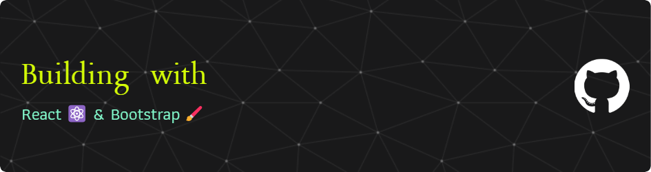

  

## About Me

Hi, I'm Sivananda Reddy, a frontend developer from India, currently learning React JS I'm constantly learning and exploring new tools and frameworks to stay updated with the latest industry trends.

## My Skills

 
 
 
 
 

## GitHub Stats

<table><tbody><tr border="none"><td width="50%" align="center">
  
</td><td width="50%" align="center">
</td></tr></tbody></table>

## Connect with me

🔗 LinkedIn: <a href="https://www.linkedin.com/in/sivananda-reddy-yerragudi-630076337" target="_blank">Sivananda Reddy Yerragudi</a>   ✉️ Gmail: reddysivananda83@gmail.com

